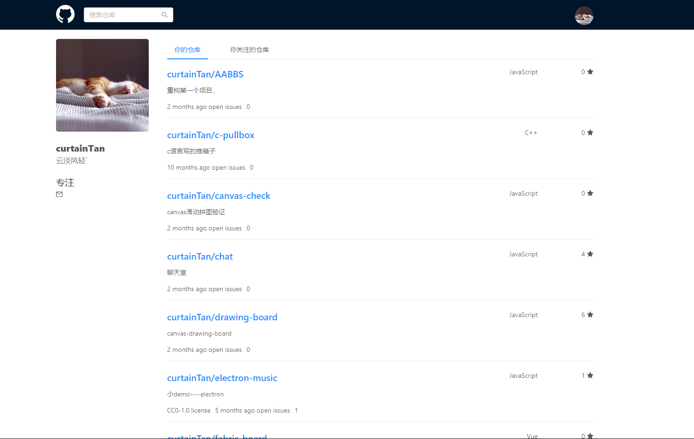
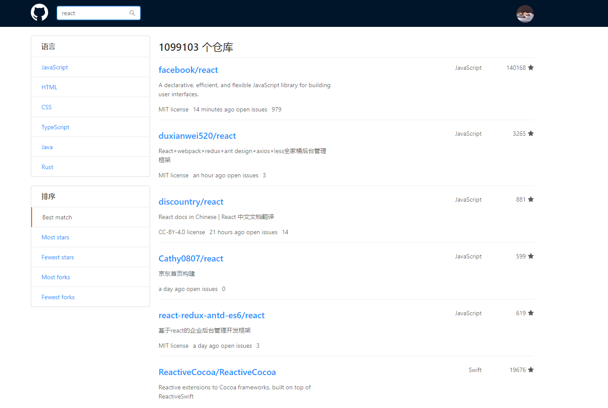

# next+hooks的github项目


预览：[点击直达](http://nextgo.curtaintan.club/)

图片：

**主页**



**搜索页面**



**detail页面**


## 项目说明：

本项目是根据默课网Jocky老师的教程完成，项目是使用nextjs+hooks+redux+antd+koa+redis构建的ssr应用。

## 项目目录介绍：

    - components                         // 组件目录
    - lib                                // 全局相关工具函数文件
        - api.js                         // api请求
        - repo-basic-cache.js            // lru-cache 缓存函数文件
        - utils.js                       // 全局工具函数--时间等处理函数
        - with-redux.js                  // 项目配置redux
    - pages                              // 页面文件
        - detail                         // 项目详情页面
        - index.js                       // 主页
        - search.js                      // 搜索页面
    - server                             // 服务器路由处理文件
        - auth.js                        // 处理用户登录
        - serve-pai.js                   // 代理url接口到github
        - session-store.js               // redis相关操作
    - store                              // redux用户数据存储
    - babelrc                            // babel配置文件
    - config.js                          // 项目全局基础配置
    - next.config.js                     // next全局基础配置
    - server.js                          // server文件


## 技术总结：


### 如何在nextjs应用中嵌套koa服务：

1. 配置server.js
```js
const Koa = require( "koa" )
const next = require( "next" )

const dev = process.env.NODE_ENV !== 'production'
const app = next( {dev} )
const handle = app.getRequestHandler()

app.prepare().then( () => {
    const server = new Koa()

    server.use( router.routes() )   // 自定义koa路由相关的处理

    // handle处理函数一定要定义在最后，避免不过api数据请求
    server.use( async ( ctx, next ) => {
        await handle( ctx.req, ctx.res )
        ctx.respond = false       // 对于不是返回数据接口的接口要返回false
    } )

    server.listen( 4321, () => {
        console.log( "服务器启动后成功----" )
    } )

} )

```
2. 配置好后，即可在package.json中添加script："node server.js"来启动项目

### 集成antd：
---
1. 配置@zeit/next-css使项目能够引用css文件

- 安装  yarn add @zeit/next-css
- 在项目根目录创建项目配置文件：next.config.js并配置：
```js
const withCss = require( "@zeit/next-css" )
if( typeof require !== "undefined" ){
    require.extensions['.css'] = file => {}
}
module.exports = withCss({})
```
即可完成css文件的引入

2. 配置antd
- 安装 babel-plugin-import 和 antd
- 在项目根目录添加.bebalrc配置文件
```js
{
    "presets": ["next/babel"],
    "plugins": [
        [
            "import",
            {
                "libraryName": "antd"
                // "style": "css"     // 可以配置按需引入
            }
        ]
    ]
}
```

- 在pages页面下_app.js文件下全局引入css文件
```js
import 'antd/dist/antd.css'
```
为什么要全局引入？
如果不全局引入，会报bundle引入警告，并在search页面跳转的时候，第一次页面渲染的时候会不引入样式，再次刷新才会引入样式。

### 配置动态路由与路由映射

1. 页面书写：
```js
<Link href="/a?id=1" as="/a/1" >     // as就是路由映射
    <a title="A页面">
        <Button>我是主页{ counter }</Button>
    </a>
</Link>
```
2. 服务端配置：
路由中的配置：
```js
router.get( "/a/:id", async ( ctx ) => {
    var id = ctx.params.id
    await handle( ctx.req, ctx.res, {
        pathname: "/a",
        query: { id }
    })
    ctx.respond = false
})
```
这样做当输入网址是动态路由时，也能渲染。

### 路由变化时的钩子函数：
```js
import Router from "next/router"
const event = [
    "routeChangeStart",
    "routeChangeComplate",
    "routeChangeError",
    "beforeHistoryChange",
    "hashChangeStart",
    "hashChangeComplate"
]
function makeEvent( type ){
    return ( ...args ) => {
        console.log( type, ...args )
    }
}
event.forEach( event => {    // 可以监听路由的变化
    Router.events.on( event, makeEvent( event ) )
}) 
```
作用：当路由跳转数据正在加载时，可以使用Loading组件提示加载中：

_app.js文件全局配置中：

```js
state = {
    loading: false
}

startLoading = () => {
    this.setState({
        loading: true
    })
}

stopLoading = () => {
    this.setState({
        loading: false
    })
}

componentDidMount(){
    Router.events.on( "routeChangeStart", this.startLoading )
    Router.events.on( "routeChangeComplete", this.stopLoading )
    Router.events.on( "routeChangeError", this.stopLoading )
}

componentWillUnmount(){
    Router.events.off( "routeChangeStart", this.startLoading )
    Router.events.off( "routeChangeComplete", this.stopLoading )
    Router.events.off( "routeChangeError", this.stopLoading )
}
```
### 异步模块和组件的加载:
```js
import dynamic from "next/dynamic"
const MDRender = dynamic( 
    () => import( "../../components/markDownRender" ),
    {
        loading: () => <p>Loading......</p>
    }
    )
```
作用：当加载的组件较大且不会更改时，可以使用，
这样使用还有一个好处，因为单独打包，打包出来的是静态hash文件，所以浏览器会缓存下这个js文件，第二次请求的时候，就可以读取缓存文件再次利用。

## getInitialProps函数相关说明：

当第一次进入页面时，服务端会执行页面的getInitialProps函数，然后返回Props数据给页面组件，这个函数在浏览器第一次进入页面时，浏览器不会执行，只有当用户进行操作使页面进行跳转时会执行这个函数，这个函数是跳转页面的getInitialProps。

在写getInitialProps函数时，要注意分清何时是服务端何时是客户端，可以使用 typeof window === "undefined"来判定是否是服务端，当知道何时是客户端时，可以做很多优化，请看程序优化模块.

```js
import LRU from "lru-cache"

const isServer = typeof window === "undefined"
const cache = new LRU({
    maxAge: 1000 * 60 * 10
})
Index.getInitialProps = async ( { ctx, reduxStore } ) => {
    if( !isServer ){
        if( cache.get( "userRepos" ) && cache.get( "userStart" ) ){
            return {
                userRepos: cache.get( "userRepos" ),
                userStart: cache.get( "userStart" )
            }
        }
    }
}

// const userStart = await api.request({  //可进行相关api请求
//     url: "/user/starred"
// }, ctx.req , ctx.res)

```

## hooks相关操作的理解与相关优化的理解：

### React 性能优化思路

我觉得React 性能优化的理念的主要方向就是这两个：

1. 减少重新 render 的次数。因为在 React 里最重(花时间最长)的一块就是 reconciliation(简单的可以理解为 diff)，如果不 render，就不会 reconciliation。


2. 减少计算的量。主要是减少重复计算，对于函数式组件来说，每次 render 都会重新从头开始执行函数调用。

在使用类组件的时候，使用的 React 优化 API 主要是：shouldComponentUpdate和  PureComponent，这两个 API 所提供的解决思路都是为了减少重新 render 的次数，主要是减少父组件更新而子组件也更新的情况，虽然也可以在 state 更新的时候阻止当前组件渲染，如果要这么做的话，证明你这个属性不适合作为 state，而应该作为静态属性或者放在 class 外面作为一个简单的变量 。

上诉文字引用自：

    作者：桃翁
    链接：https://juejin.im/post/5dd337985188252a1873730f
    来源：掘金
    著作权归作者所有。商业转载请联系作者获得授权，非商业转载请注明出处。

其实使用react hooks开发（函数式组件开发），最大是问题就是当props变化时，会重新执行整个函数，这样就会导致很大的性能浪费，我们所要做的就是，尽量避免一些函数的执行，所以有了mome，useMemo，useCallback函数的存在，因为是函数是组件，所以要避免闭包陷阱，所以有了useRef函数。函数组件，没有生命周期，所以有了useEffect函数，要学会合理使用他们，还需要不断的学习。

可以参看上文引用的文章，写得蛮不错的。


## 性能优化相关：

在编写程序时，我们要对我们需要的数据进行思考，要保证什么数据是可以进行缓存的。

在编写项目是，可以把不常改变的数据进行一段时间的缓存，因为服务端的资源是宝贵的，所以我们可以把数据缓存在客户端，在getInitialProps函数里面使用'   const isServer = typeof window === "undefined"   '来判定是客户端还是用户端，可以使用lru-cache模块进行数据的缓存，也可以定义一个对象来缓存数据，在页面的getInitialProps函数里面来判定这些数据是否已经被缓存，如果已经缓存，就可以取出来使用，避免了数据请求的耗时，加快页面的显示，优化用户体验：

```js
const isServer = typeof window === "undefined"
const Index = () => {}
Index.getInitialProps = async ({ ctx }) => {
    if( !isServer ){
        if( cache.get( "userRepos" ) && cache.get( "userStart" ) ){
            return {
                userRepos: cache.get( "userRepos" ),
                userStart: cache.get( "userStart" )
            }
        }
    }
    if( user && user.id ){
        const userRepos = await api.request( {
            url: "/user/repos"
        }, ctx.req , ctx.res )
        
        const userStart = await api.request({
            url: "/user/starred"
        }, ctx.req , ctx.res)

        return {
            userRepos: userRepos.data,
            userStart: userStart.data
        }
    }
}
```

当发起的请求可以并行时，我们可以把两个请求合并到一起发送：

/pages/detail/issues.js

```js
Issues.getInitialProps = async ({ ctx }) => {
    const { owner, name } = ctx.query
    const full_name = `${owner}/${name}`
    
    const fetch = await Promise.all([
        await api.request({
            url: `/repos/${owner}/${name}/issues`
        }, ctx.req, ctx.res),
        CACHE[full_name] ? Promise.resolve({ data: CACHE[full_name] }) : await api.request({
            url: `/repos/${owner}/${name}/labels`
        }, ctx.req, ctx.res)
    ])

    return {
        InitIssues: fetch[0].data,
        labels: fetch[1].data,
        owner, name
    }
}
```

## HOC高阶函数的理解：

/lib/with-redux.js        使用了hoc

withRouter也是使用hoc实现。

要理解何时使用hoc，当我们需要对下面的组件需要添加一些属性时，我们可以使用，
当我们编写hoc组件时，尽量把所有传进来的参数都要传下去。

/lib/with-redux.js
```js
import React from "react"
import createStore from "../store/store"

const isServer = typeof window === "undefined"
const _NEXT_REDUX_STORE_ = "_NEXT_REDUX_STORE_"

function getOrCreateStore( initState ){
    if( isServer ){
        return createStore( initState )
    }
    if( !window[_NEXT_REDUX_STORE_] ){
        window[_NEXT_REDUX_STORE_] = createStore( initState )
    }
    return window[_NEXT_REDUX_STORE_]
}

export default ( Comp ) => {
    class withReduxApp extends React.Component {

        constructor( props ) {
            super( props )
            this.reduxStore = getOrCreateStore( props.initialReduxState )
        }

        render() {
            const { Component, pageProps, ...rest } = this.props

            return <Comp Component={ Component } pageProps={ pageProps } {...rest} reduxStore={ this.reduxStore} />
        }
    }

    withReduxApp.getInitialProps = async ( ctx ) => {

        let reduxStore
        if( isServer ){
            const { req } = ctx.ctx
            const session = req.session

            if( session && session.userInfo ){
                reduxStore = getOrCreateStore({
                    user: session.userInfo
                })
            } else {
                reduxStore = getOrCreateStore()
            }
        } else {
            reduxStore = getOrCreateStore()
        }
        
        ctx.reduxStore = reduxStore

        let appProps = {}
        if( typeof Comp.getInitialProps === "function" ){
            appProps = await Comp.getInitialProps( ctx )
        }

        return {
            ...appProps,
            initialReduxState: reduxStore.getState()
        }
    }
    return withReduxApp
}

```
/pages/_app.js
```js
import App from "next/app"
import withReduxApp from "../lib/with_redux"
class MyApp extends App{
    static async getInitialProps( ctx ){
        const { Component } = ctx
        let pageProps = {}
        if( Component.getInitialProps ){
            pageProps = await Component.getInitialProps( ctx )
        }
        return {
            pageProps
        }
    }
    // ......
}

export default withReduxApp( MyApp )
```


# 后言：

通过整个项目的学习，让我更加深入的理解了react组件开发的精髓，而且对高阶组件和react hooks有了更深的理解。

写下这篇文章，希望对你有帮助。


# 加油！与君共勉！！！

